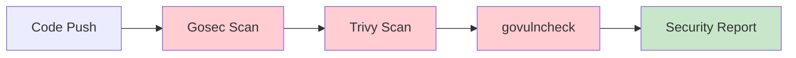
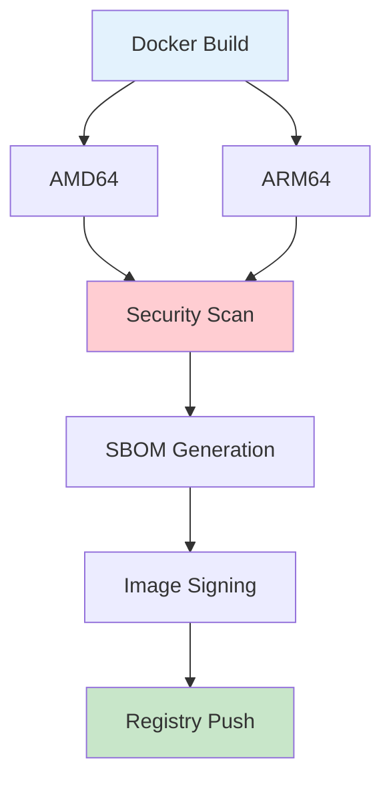
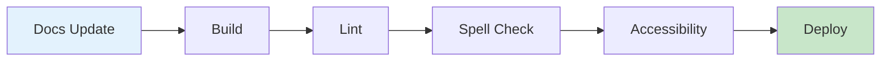

# GitHub Actions Workflows

This project includes comprehensive GitHub Actions workflows for CI/CD, security scanning, and OSS Scorecard compliance.

## 🔄 Workflow Overview

```mermaid
graph TB
    subgraph "CI/CD Pipeline"
        A[Code Push/PR] --> B[Test]
        B --> C[Security Scan]
        C --> D[Docker Build]
        D --> E[Documentation]
        E --> F[OSS Scorecard]
    end
    
    subgraph "Security Workflows"
        G[Dependabot] --> H[Dependency Review]
        H --> I[Security Scan]
        I --> J[Vulnerability Check]
    end
    
    subgraph "Documentation"
        K[Docs Update] --> L[Build]
        L --> M[Lint]
        M --> N[Deploy]
    end
    
    style A fill:#e3f2fd
    style F fill:#c8e6c9
    style J fill:#ffcdd2
    style N fill:#fff3e0
```



## 📋 Available Workflows

### 1. Main CI/CD Pipeline (`ci.yml`)

**Triggers**: Push to main/develop, Pull Requests, Releases

**Jobs**:
- **Test**: Go code testing, linting, and coverage
- **Security**: Security scanning with Gosec, Trivy, and govulncheck
- **Docker**: Multi-architecture Docker build and security scan
- **Documentation**: MkDocs documentation build
- **OSS Scorecard**: Supply chain security assessment
- **CodeQL**: Static analysis for security vulnerabilities
- **Release**: Automated release notes and asset upload

**Features**:
- ✅ Go testing with race detection
- ✅ Static analysis with golangci-lint
- ✅ Security vulnerability scanning
- ✅ Multi-architecture Docker builds
- ✅ Automated security scanning
- ✅ OSS Scorecard compliance
- ✅ CodeQL analysis

### 2. OSS Scorecard (`scorecard.yml`)

**Triggers**: Push to main, Pull Requests, Weekly schedule, Manual

**Features**:
- ✅ Supply chain security assessment
- ✅ Security policy compliance
- ✅ Dependency security analysis
- ✅ Automated security scoring
- ✅ PR comments with security results
- ✅ Weekly security monitoring

**Security Checks**:
- Branch protection rules
- Code review requirements
- Dependency security
- Vulnerability scanning
- License compliance
- Security policy presence

### 3. Docker Build (`docker.yml`)

**Triggers**: Push to main/develop, Tags, Pull Requests

**Features**:
- ✅ Multi-architecture builds (amd64, arm64)
- ✅ Container vulnerability scanning
- ✅ SBOM generation
- ✅ Image signing with cosign
- ✅ Compliance checking
- ✅ Security scanning

### 4. Documentation (`docs.yml`)

**Triggers**: Push to main/develop, Pull Requests (docs changes)

**Features**:
- ✅ MkDocs documentation build
- ✅ Link checking
- ✅ Mermaid diagram validation
- ✅ Spell checking
- ✅ Accessibility testing
- ✅ Performance monitoring
- ✅ GitHub Pages deployment

### 5. Dependabot Security (`dependabot.yml`)

**Triggers**: Dependabot pull requests

**Features**:
- ✅ Automated dependency review
- ✅ Security vulnerability checking
- ✅ License compliance verification
- ✅ Breaking change detection
- ✅ Automated approval for security updates

## 🔒 Security Features

### Vulnerability Scanning



### Security Tools Used

| Tool | Purpose | Scope |
|------|---------|-------|
| **Gosec** | Go security scanner | Source code |
| **Trivy** | Vulnerability scanner | Dependencies, containers |
| **govulncheck** | Go vulnerability checker | Go modules |
| **CodeQL** | Static analysis | Security vulnerabilities |
| **OSS Scorecard** | Supply chain security | Repository security |
| **Dependabot** | Dependency updates | Security patches |

### Security Scanning Pipeline

1. **Static Analysis**: Gosec scans for security issues in Go code
2. **Dependency Scanning**: Trivy checks for known vulnerabilities
3. **Container Scanning**: Docker images scanned for security issues
4. **Supply Chain**: OSS Scorecard assesses repository security
5. **Vulnerability Check**: govulncheck identifies Go-specific vulnerabilities

## 🐳 Docker Features

### Multi-Architecture Builds



### Container Security

- **Vulnerability Scanning**: Trivy scans for known vulnerabilities
- **SBOM Generation**: Software Bill of Materials for transparency
- **Image Signing**: Cosign signing for authenticity
- **Multi-Architecture**: Support for AMD64 and ARM64
- **Security Scanning**: Comprehensive security analysis

## 📊 OSS Scorecard

### Security Metrics

The OSS Scorecard evaluates the following security aspects:

| Metric | Description | Importance |
|--------|-------------|------------|
| **Branch Protection** | Protected main branch | Critical |
| **Code Review** | Required code reviews | High |
| **Dependencies** | Pinned dependencies | High |
| **Vulnerabilities** | Known vulnerabilities | Critical |
| **License** | Open source license | Medium |
| **Security Policy** | Security policy presence | High |
| **Signed Releases** | Cryptographically signed releases | Medium |
| **Packaging** | Proper packaging | Medium |

### Scorecard Configuration

```yaml
# OSS Scorecard checks enabled
enable-licenses: true
enable-dependency-review: true
enable-fuzzing: true
enable-maintained: true
enable-pinned-dependencies: true
enable-packaging: true
enable-sast: true
enable-security-policy: true
enable-signed-releases: true
enable-branch-protection: true
enable-code-review: true
enable-contributors: true
enable-token-permissions: true
enable-vulnerabilities: true
```

## 🔄 Dependabot Configuration

### Automated Updates

```yaml
# Dependabot configuration
updates:
  - package-ecosystem: "gomod"
    schedule:
      interval: "weekly"
      day: "monday"
      time: "09:00"
    open-pull-requests-limit: 10
```

### Supported Ecosystems

- **Go Modules**: Automated Go dependency updates
- **GitHub Actions**: Action version updates
- **Docker**: Base image updates
- **Python**: MkDocs dependencies

## 📚 Documentation Pipeline

### Documentation Features



### Quality Checks

- **Link Validation**: Check for broken links
- **Spell Checking**: Automated spell checking
- **Accessibility**: Accessibility compliance
- **Performance**: Site performance monitoring
- **Mermaid Validation**: Diagram syntax checking

## 🚀 Deployment

### Automated Deployment

1. **Push to Main**: Triggers full CI/CD pipeline
2. **Security Scanning**: Comprehensive security analysis
3. **Docker Build**: Multi-architecture container builds
4. **Documentation**: MkDocs site deployment
5. **Release**: Automated release with assets

### Deployment Targets

- **GitHub Container Registry**: Docker images
- **GitHub Pages**: Documentation site
- **GitHub Releases**: Release artifacts

## 📈 Monitoring and Metrics

### Pipeline Metrics

- **Build Success Rate**: Track build success/failure rates
- **Security Scan Results**: Monitor security findings
- **Test Coverage**: Track code coverage metrics
- **Dependency Updates**: Monitor dependency security
- **OSS Scorecard Score**: Track security score trends

### Alerting

- **Security Vulnerabilities**: Immediate alerts for critical issues
- **Build Failures**: Notifications for failed builds
- **Dependency Updates**: Alerts for security updates
- **Scorecard Changes**: Notifications for score changes

## 🔧 Configuration

### Environment Variables

```yaml
# Required secrets
GITHUB_TOKEN: ${{ secrets.GITHUB_TOKEN }}
CODECOV_TOKEN: ${{ secrets.CODECOV_TOKEN }}
```

### Workflow Permissions

```yaml
# Required permissions
permissions:
  contents: read
  packages: write
  security-events: write
  id-token: write
```

## 🛠️ Customization

### Adding New Workflows

1. **Create workflow file** in `.github/workflows/`
2. **Define triggers** and jobs
3. **Configure security scanning**
4. **Add to main pipeline**
5. **Test and validate**

### Security Scanning

To add new security tools:

1. **Add tool to workflow**
2. **Configure scanning parameters**
3. **Set up result reporting**
4. **Add to security pipeline**

## 📋 Best Practices

### Security

- ✅ Use pinned dependency versions
- ✅ Enable branch protection rules
- ✅ Require code reviews
- ✅ Implement security scanning
- ✅ Monitor for vulnerabilities

### CI/CD

- ✅ Fast feedback loops
- ✅ Comprehensive testing
- ✅ Security scanning
- ✅ Automated deployment
- ✅ Quality gates

### Documentation

- ✅ Keep documentation updated
- ✅ Validate links and content
- ✅ Ensure accessibility
- ✅ Monitor performance

## 🆘 Troubleshooting

### Common Issues

1. **Build Failures**: Check Go version compatibility
2. **Security Scan Failures**: Review security findings
3. **Docker Build Issues**: Verify Dockerfile syntax
4. **Documentation Errors**: Check MkDocs configuration

### Debug Mode

Enable debug logging in workflows:

```yaml
- name: Debug
  run: |
    echo "Debug information"
    env | sort
```

---

**The GitHub Actions workflows provide comprehensive CI/CD, security scanning, and OSS Scorecard compliance for the Security Event Exporter project! 🚀🔒**
