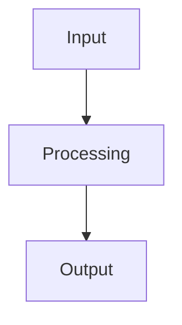
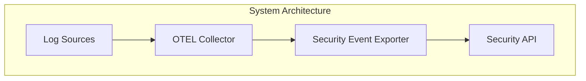

# MkDocs Documentation Site

This project includes a comprehensive MkDocs documentation site with interactive Mermaid diagrams to replace ASCII art schemas.

## 🚀 Quick Start

### 1. Install Dependencies

```bash
# Create virtual environment
python3 -m venv venv
source venv/bin/activate

# Install MkDocs and dependencies
pip install -r requirements.txt
```

### 2. Serve Documentation Locally

```bash
# Use the provided script
./serve-docs.sh

# Or manually
source venv/bin/activate
mkdocs serve --dev-addr=0.0.0.0:8000
```

### 3. Access Documentation

Open your browser and navigate to: **http://localhost:8000**

## 📚 Documentation Structure

```
docs/
├── index.md                           # Main homepage with overview
├── getting-started/                   # Getting started guides
│   ├── quick-start.md                 # Quick start guide
│   └── configuration.md               # Configuration guide
├── features/                          # Feature documentation
│   ├── architecture.md                # System architecture with Mermaid diagrams
│   ├── security-event-format.md       # Security event format
│   └── event-batching.md              # Event batching feature
├── monitoring/                        # Monitoring and observability
│   └── telemetry-metrics.md           # Telemetry metrics guide
└── deployment/                        # Deployment guides
    └── docker-deployment.md           # Docker deployment
```

## 🎨 Features

### Material Design Theme
- Beautiful, responsive design
- Dark/light mode toggle
- Mobile-friendly interface
- Professional appearance

### Mermaid Diagrams
- Interactive system architecture diagrams
- Data flow visualizations
- Component relationship diagrams
- Performance metrics charts

### Navigation
- Easy-to-use sidebar navigation
- Table of contents for each page
- Search functionality
- Breadcrumb navigation

## 🔧 Configuration

### MkDocs Configuration

The site is configured via `mkdocs.yml`:

```yaml
site_name: OpenTelemetry Security Event Exporter
theme:
  name: material
  palette:
    - scheme: default
      primary: orange
      accent: orange
    - scheme: slate
      primary: orange
      accent: orange
```

### Mermaid Integration

Mermaid diagrams are integrated using the `mkdocs-mermaid2-plugin`:

```markdown

```

## 📖 Content Highlights

### Architecture Documentation
- System architecture with interactive diagrams
- Component relationships and data flow
- Deployment patterns and scaling strategies

### Event Batching
- Visual representation of batching process
- Performance benefits and optimization strategies
- Configuration examples and best practices

### Telemetry Metrics
- Comprehensive metrics overview
- Monitoring and alerting strategies
- Performance optimization guidance

### Docker Deployment
- Production-ready deployment configurations
- Security considerations and best practices
- Troubleshooting and maintenance guides

## 🚀 Deployment

### Build Static Site

```bash
# Build static site
mkdocs build

# Output will be in the 'site' directory
```

### Deploy to GitHub Pages

```bash
# Deploy to GitHub Pages
mkdocs gh-deploy
```

### Custom Hosting

```bash
# Build and upload to your web server
mkdocs build
# Upload 'site' directory to your web server
```

## 🛠️ Development

### Adding New Content

1. **Create new markdown files** in the appropriate `docs/` subdirectory
2. **Add navigation entries** in `mkdocs.yml`
3. **Include Mermaid diagrams** for complex concepts
4. **Test locally** using `./serve-docs.sh`

### Mermaid Diagram Examples



### Code Examples

Include working code examples with syntax highlighting:

```yaml
exporters:
  securityevent:
    endpoint: https://api.example.com/events
    headers:
      authorization: "Bearer token"
```

## 📊 Benefits

### For Users
- **Easy Navigation**: Intuitive structure and search
- **Visual Understanding**: Interactive diagrams and charts
- **Comprehensive Coverage**: Complete documentation for all features
- **Mobile Access**: Responsive design for all devices

### For Developers
- **Maintainable**: Markdown-based content management
- **Version Controlled**: Documentation changes tracked in Git
- **Automated**: Build and deployment automation
- **Extensible**: Easy to add new content and features

## 🔍 Troubleshooting

### Common Issues

1. **Virtual Environment**: Make sure to activate the virtual environment
2. **Dependencies**: Install all requirements from `requirements.txt`
3. **Port Conflicts**: Use different port if 8000 is occupied
4. **Mermaid Rendering**: Check browser console for JavaScript errors

### Debug Mode

```bash
# Run with verbose output
mkdocs serve --verbose

# Check configuration
mkdocs build --strict
```

## 📝 Contributing

1. **Edit documentation files** in the `docs/` directory
2. **Test locally** using `./serve-docs.sh`
3. **Submit pull requests** for review
4. **Follow the style guide** for consistency

## 🌐 Live Demo

Once deployed, the documentation site provides:

- **Interactive Navigation**: Easy browsing of all documentation
- **Search Functionality**: Find information quickly
- **Responsive Design**: Works on all devices
- **Professional Appearance**: Clean, modern interface

---

**The MkDocs site transforms the Security Event Exporter documentation into a professional, interactive experience with beautiful Mermaid diagrams replacing ASCII art schemas! 📚✨**
