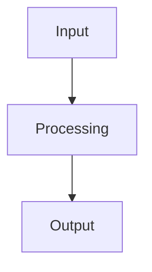

# Documentation

This directory contains the complete documentation for the OpenTelemetry Security Event Exporter.

## 📚 Documentation Structure

```
docs/
├── index.md                           # Main documentation homepage
├── getting-started/                   # Getting started guides
│   ├── quick-start.md                 # Quick start guide
│   ├── installation.md                # Installation instructions
│   └── configuration.md               # Configuration guide
├── features/                          # Feature documentation
│   ├── architecture.md                # System architecture
│   ├── security-event-format.md       # Security event format
│   └── event-batching.md              # Event batching feature
├── monitoring/                        # Monitoring and observability
│   ├── telemetry-metrics.md           # Telemetry metrics guide
│   └── logging-and-debugging.md       # Logging and debugging
├── deployment/                        # Deployment guides
│   ├── docker-deployment.md           # Docker deployment
│   ├── kubernetes-deployment.md       # Kubernetes deployment
│   └── configuration-examples.md      # Configuration examples
├── development/                       # Development documentation
│   ├── api-reference.md               # API reference
│   ├── contributing.md                # Contributing guide
│   └── building-from-source.md        # Building from source
└── troubleshooting/                   # Troubleshooting guides
    ├── common-issues.md               # Common issues and solutions
    └── performance-tuning.md          # Performance tuning guide
```

## 🚀 Quick Start

### Local Development

1. **Install MkDocs dependencies:**
   ```bash
   pip3 install -r requirements.txt
   ```

2. **Serve documentation locally:**
   ```bash
   ./serve-docs.sh
   ```

3. **Open your browser:**
   Navigate to http://localhost:8000

### Building Static Site

```bash
# Build static site
mkdocs build

# Output will be in the 'site' directory
```

## 🎨 Features

- **Material Design**: Beautiful, responsive design
- **Mermaid Diagrams**: Interactive diagrams and flowcharts
- **Search**: Full-text search across all documentation
- **Navigation**: Easy navigation with table of contents
- **Mobile Friendly**: Responsive design for all devices
- **Dark Mode**: Toggle between light and dark themes

## 📖 Content Guidelines

### Writing Style

- Use clear, concise language
- Include code examples where appropriate
- Add diagrams to explain complex concepts
- Keep sections focused and well-organized

### Mermaid Diagrams

Use Mermaid diagrams to replace ASCII art schemas:



### Code Examples

Include working code examples:

```yaml
exporters:
  securityevent:
    endpoint: https://api.example.com/events
    headers:
      authorization: "Bearer token"
```

## 🔧 Customization

### Theme Configuration

The documentation uses the Material theme with custom configuration in `mkdocs.yml`:

- **Primary Color**: Orange
- **Accent Color**: Orange
- **Features**: Search, navigation, tabs, and more

### Plugins

- **mermaid2**: For interactive diagrams
- **search**: For full-text search
- **pymdown-extensions**: For enhanced Markdown features

## 📝 Contributing

1. **Edit documentation files** in the `docs/` directory
2. **Test locally** using `./serve-docs.sh`
3. **Submit pull requests** for review
4. **Follow the style guide** for consistency

## 🌐 Deployment

### GitHub Pages

```bash
# Deploy to GitHub Pages
mkdocs gh-deploy
```

### Custom Hosting

```bash
# Build static site
mkdocs build

# Upload 'site' directory to your web server
```

## 📊 Analytics

The documentation site can be configured with analytics in `mkdocs.yml`:

```yaml
extra:
  analytics:
    provider: google
    property: G-XXXXXXXXXX
```

## 🆘 Support

- **Documentation Issues**: Report on GitHub Issues
- **Content Questions**: Join GitHub Discussions
- **Technical Support**: Check the troubleshooting guides

---

**Happy documenting! 📚✨**
