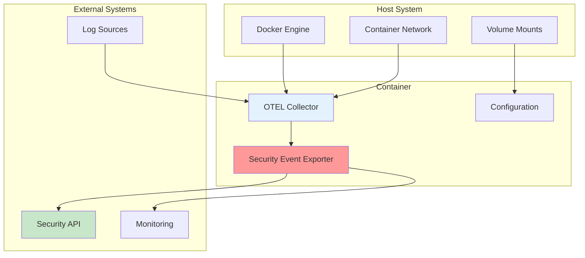
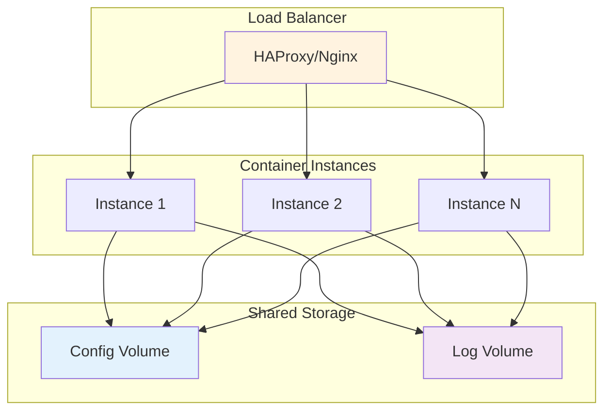
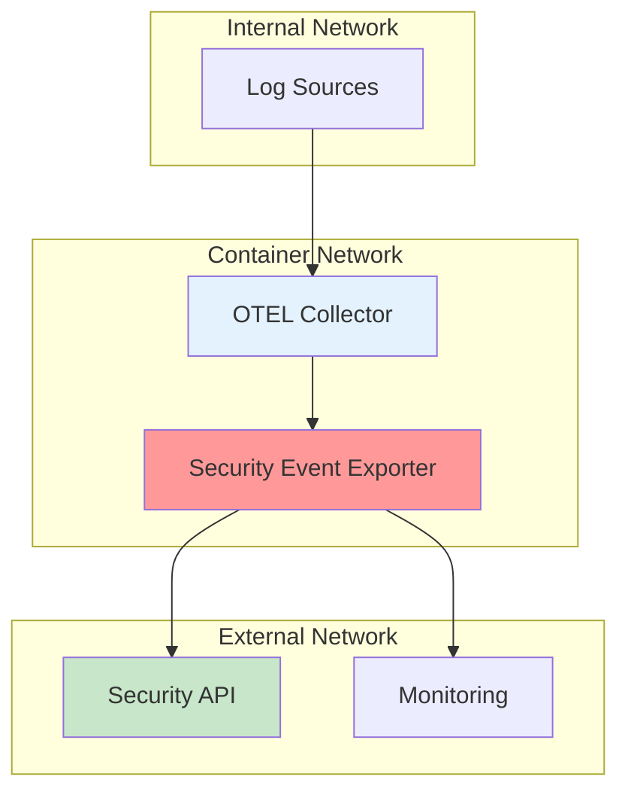
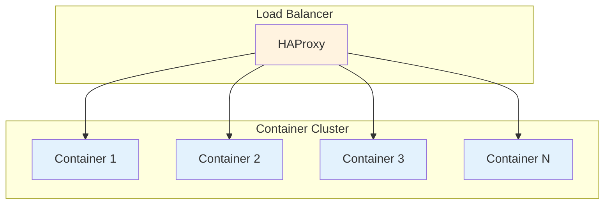

# Docker Deployment

Deploy the Security Event Exporter using Docker for containerized environments.

## Quick Start

### Basic Deployment

```bash
# Run the collector with default configuration
docker run -d \
  --name otel-security-exporter \
  -p 4317:4317 \
  -p 8888:8888 \
  -p 13133:13133 \
  hrexed/otel-collector-sec-event:latest
```

### Custom Configuration

```bash
# Run with custom configuration file
docker run -d \
  --name otel-security-exporter \
  -p 4317:4317 \
  -p 8888:8888 \
  -p 13133:13133 \
  -v $(pwd)/config.yaml:/otel/config.yaml \
  hrexed/otel-collector-sec-event:latest \
  --config /otel/config.yaml
```

## Deployment Architecture



## Configuration Options

### Environment Variables

```bash
docker run -d \
  --name otel-security-exporter \
  -p 4317:4317 \
  -p 8888:8888 \
  -e OTEL_SECURITY_ENDPOINT="https://api.example.com/events" \
  -e OTEL_SECURITY_API_TOKEN="your-token" \
  -e OTEL_SECURITY_TIMEOUT="30s" \
  hrexed/otel-collector-sec-event:latest
```

### Configuration File Mount

```bash
# Create configuration directory
mkdir -p ./otel-config

# Create configuration file
cat > ./otel-config/config.yaml << 'EOF'
receivers:
  otlp:
    protocols:
      grpc:
        endpoint: 0.0.0.0:4317
      http:
        endpoint: 0.0.0.0:4318

processors:
  batch:

exporters:
  securityevent:
    endpoint: https://api.example.com/security-events
    headers:
      authorization: "Bearer your-api-token"
    default_attributes:
      source: "docker-deployment"
      environment: "production"

service:
  pipelines:
    logs:
      receivers: [otlp]
      processors: [batch]
      exporters: [securityevent]
EOF

# Run with mounted configuration
docker run -d \
  --name otel-security-exporter \
  -p 4317:4317 \
  -p 8888:8888 \
  -v $(pwd)/otel-config:/otel/config \
  hrexed/otel-collector-sec-event:latest \
  --config /otel/config/config.yaml
```

## Production Deployment

### High Availability Setup



### Docker Compose Deployment

```yaml
version: '3.8'

services:
  otel-security-exporter:
    image: hrexed/otel-collector-sec-event:latest
    container_name: otel-security-exporter
    ports:
      - "4317:4317"
      - "4318:4318"
      - "8888:8888"
      - "13133:13133"
    volumes:
      - ./config:/otel/config
      - ./logs:/otel/logs
    environment:
      - OTEL_SECURITY_ENDPOINT=https://api.example.com/events
      - OTEL_SECURITY_API_TOKEN=${SECURITY_API_TOKEN}
    restart: unless-stopped
    healthcheck:
      test: ["CMD", "wget", "--no-verbose", "--tries=1", "--spider", "http://localhost:13133/"]
      interval: 30s
      timeout: 30s
      retries: 3
      start_period: 5s
    networks:
      - otel-network

networks:
  otel-network:
    driver: bridge
```

### Resource Limits

```yaml
version: '3.8'

services:
  otel-security-exporter:
    image: hrexed/otel-collector-sec-event:latest
    container_name: otel-security-exporter
    ports:
      - "4317:4317"
      - "8888:8888"
    volumes:
      - ./config:/otel/config
    environment:
      - OTEL_SECURITY_ENDPOINT=https://api.example.com/events
    deploy:
      resources:
        limits:
          cpus: '2.0'
          memory: 2G
        reservations:
          cpus: '0.5'
          memory: 512M
    restart: unless-stopped
```

## Security Configuration

### Network Security



### TLS Configuration

```yaml
exporters:
  securityevent:
    endpoint: https://api.example.com/security-events
    headers:
      authorization: "Bearer your-api-token"
    tls:
      insecure: false
      cert_file: /otel/certs/client.crt
      key_file: /otel/certs/client.key
      ca_file: /otel/certs/ca.crt
```

### Secrets Management

```bash
# Using Docker secrets
echo "your-api-token" | docker secret create security_api_token -

# Run with secrets
docker run -d \
  --name otel-security-exporter \
  -p 4317:4317 \
  -p 8888:8888 \
  --secret security_api_token \
  hrexed/otel-collector-sec-event:latest
```

## Monitoring and Logging

### Log Configuration

```yaml
service:
  telemetry:
    logs:
      level: info
      output_paths: ["/otel/logs/collector.log"]
    metrics:
      address: 0.0.0.0:8888
```

### Health Checks

```bash
# Check container health
docker ps --format "table {{.Names}}\t{{.Status}}"

# Check collector health
curl http://localhost:13133/

# Check metrics
curl http://localhost:8888/metrics
```

### Log Monitoring

```bash
# View logs
docker logs otel-security-exporter

# Follow logs
docker logs -f otel-security-exporter

# View specific log patterns
docker logs otel-security-exporter | grep "security_event"
```

## Scaling and Performance

### Horizontal Scaling



### Performance Tuning

```yaml
# High throughput configuration
processors:
  batch:
    timeout: 5s
    send_batch_size: 1000
    send_batch_max_size: 2000

exporters:
  securityevent:
    endpoint: https://api.example.com/events
    timeout: 30s
    headers:
      authorization: "Bearer token"
```

### Resource Monitoring

```bash
# Monitor container resources
docker stats otel-security-exporter

# Monitor specific metrics
docker exec otel-security-exporter wget -qO- http://localhost:8888/metrics | grep security_event
```

## Troubleshooting

### Common Issues

1. **Container won't start**
   ```bash
   # Check container logs
   docker logs otel-security-exporter
   
   # Check configuration
   docker exec otel-security-exporter cat /otel/config.yaml
   ```

2. **Port conflicts**
   ```bash
   # Check port usage
   netstat -tulpn | grep :4317
   
   # Use different ports
   docker run -p 4318:4317 otel-security-exporter
   ```

3. **Configuration errors**
   ```bash
   # Validate configuration
   docker exec otel-security-exporter /otel/otelcol-security --config /otel/config.yaml --dry-run
   ```

### Debug Mode

```bash
# Run with debug logging
docker run -d \
  --name otel-security-exporter \
  -p 4317:4317 \
  -p 8888:8888 \
  -e OTEL_LOG_LEVEL=debug \
  hrexed/otel-collector-sec-event:latest
```

### Performance Debugging

```bash
# Monitor container performance
docker exec otel-security-exporter top

# Check network connectivity
docker exec otel-security-exporter wget -qO- https://api.example.com/health

# Monitor logs for performance metrics
docker logs otel-security-exporter | grep "performance"
```

## Backup and Recovery

### Configuration Backup

```bash
# Backup configuration
docker cp otel-security-exporter:/otel/config.yaml ./config-backup.yaml

# Backup logs
docker cp otel-security-exporter:/otel/logs ./logs-backup/
```

### Container Backup

```bash
# Create container image
docker commit otel-security-exporter otel-security-exporter:backup

# Save container image
docker save otel-security-exporter:backup > otel-backup.tar
```

### Recovery

```bash
# Restore from backup
docker load < otel-backup.tar

# Run restored container
docker run -d \
  --name otel-security-exporter-restored \
  -p 4317:4317 \
  -p 8888:8888 \
  otel-security-exporter:backup
```

## Updates and Maintenance

### Rolling Updates

```bash
# Pull latest image
docker pull hrexed/otel-collector-sec-event:latest

# Stop current container
docker stop otel-security-exporter

# Remove old container
docker rm otel-security-exporter

# Start new container
docker run -d \
  --name otel-security-exporter \
  -p 4317:4317 \
  -p 8888:8888 \
  hrexed/otel-collector-sec-event:latest
```

### Maintenance Tasks

```bash
# Clean up old containers
docker container prune

# Clean up old images
docker image prune

# Clean up volumes
docker volume prune
```
