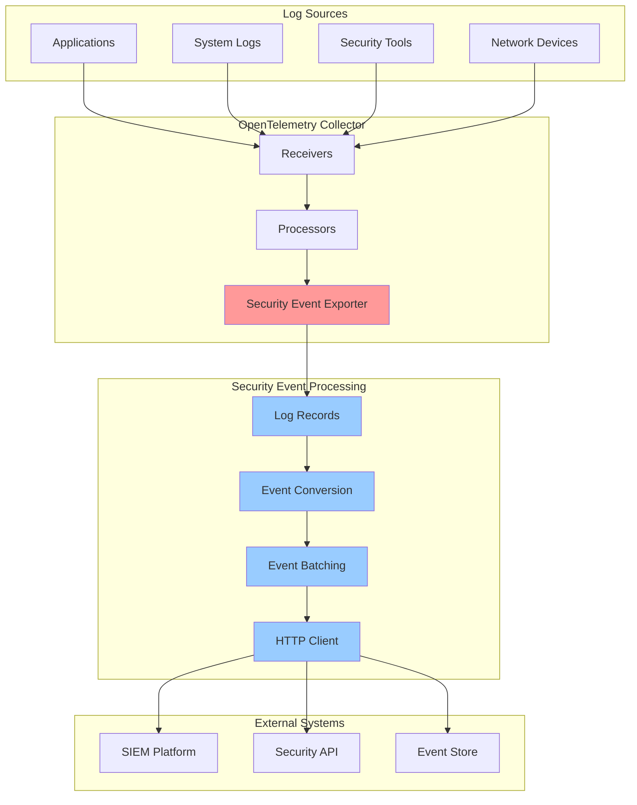
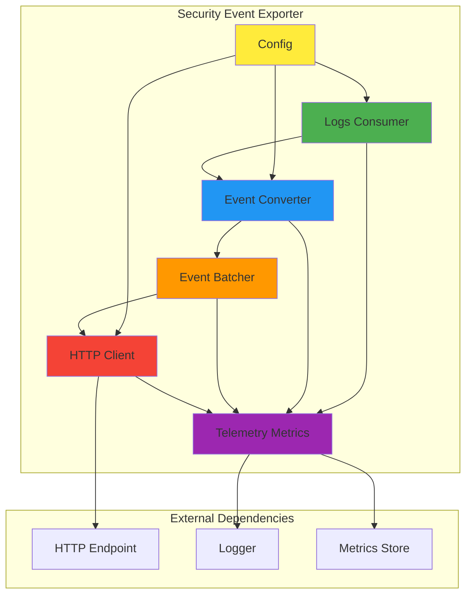
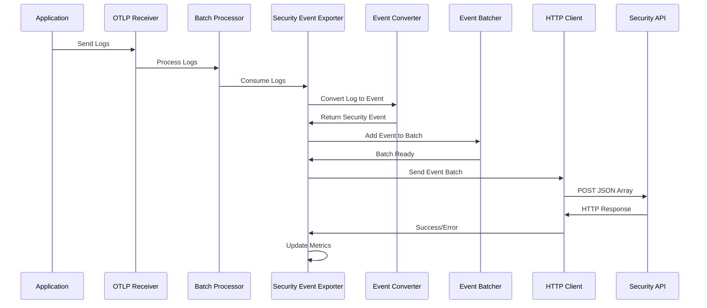
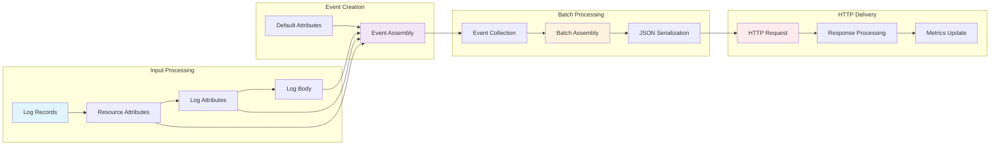
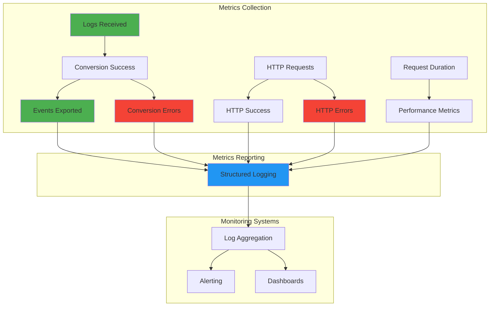
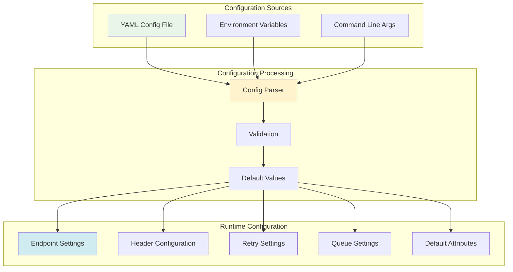
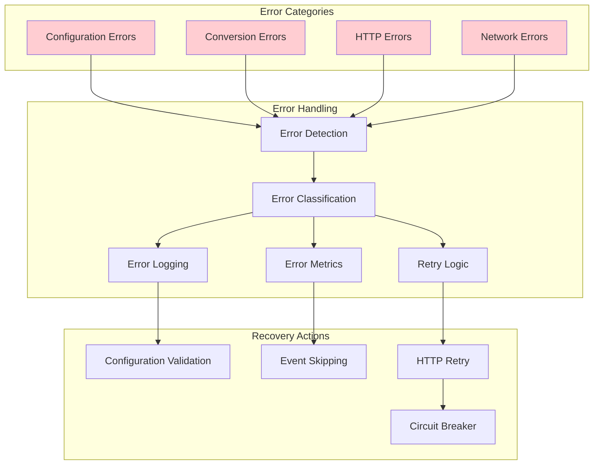
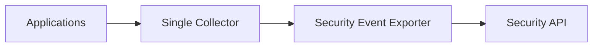
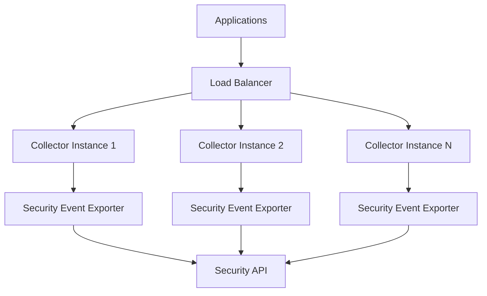
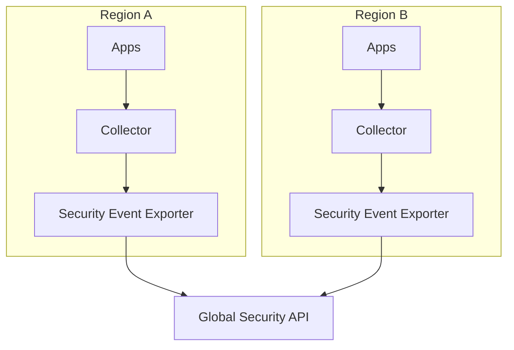

# Architecture

The Security Event Exporter is designed as a custom component for the OpenTelemetry Collector, providing efficient log-to-security-event transformation and HTTP delivery.

## System Architecture

## Component Architecture

## Data Flow

## Event Processing Pipeline

## Telemetry Metrics Flow

## Configuration Architecture

## Error Handling Architecture

## Performance Characteristics

### Throughput
- **Batch Processing**: Events are batched for efficient HTTP delivery
- **Concurrent Processing**: Multiple log records processed in parallel
- **Memory Management**: Efficient memory usage with streaming processing

### Latency
- **Low Latency**: Direct HTTP delivery without intermediate storage
- **Configurable Timeouts**: Adjustable HTTP timeouts for different environments
- **Retry Logic**: Built-in retry mechanism for transient failures

### Scalability
- **Horizontal Scaling**: Multiple collector instances can be deployed
- **Load Balancing**: HTTP requests can be load balanced across endpoints
- **Resource Efficiency**: Minimal resource footprint with efficient processing

## Security Considerations

### Data Protection
- **Secure Headers**: Support for authentication headers and API tokens
- **TLS Support**: HTTPS endpoint support for encrypted communication
- **Sensitive Data**: Logging excludes sensitive header information

### Network Security
- **Firewall Friendly**: Uses standard HTTP/HTTPS protocols
- **Proxy Support**: Compatible with corporate proxies and firewalls
- **Network Isolation**: Can be deployed in isolated network segments

## Deployment Patterns

### Single Instance

### High Availability

### Distributed Deployment

