# Event Batching

The Security Event Exporter implements intelligent event batching to optimize HTTP requests and improve overall throughput. This feature reduces the number of HTTP calls while maintaining low latency and high reliability.

## Batching Overview

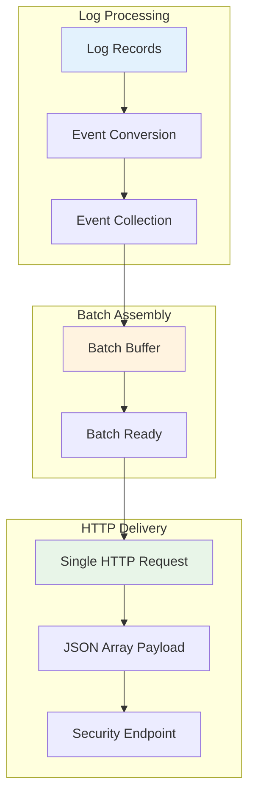

## How Batching Works

### 1. Log Collection Phase

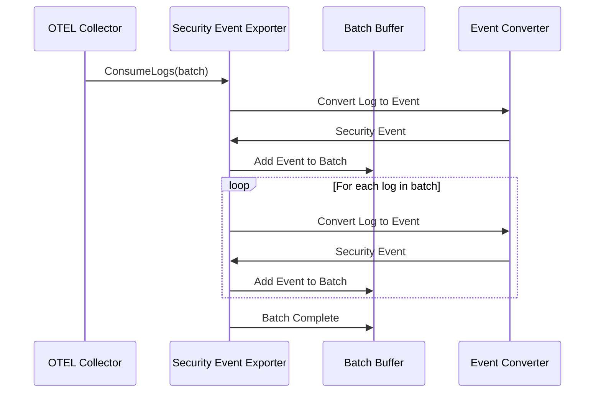

### 2. Batch Assembly

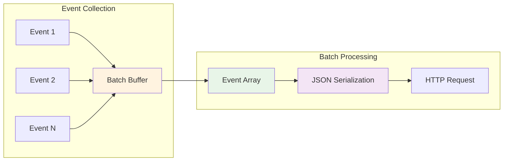

## Batching Benefits

### Performance Improvements

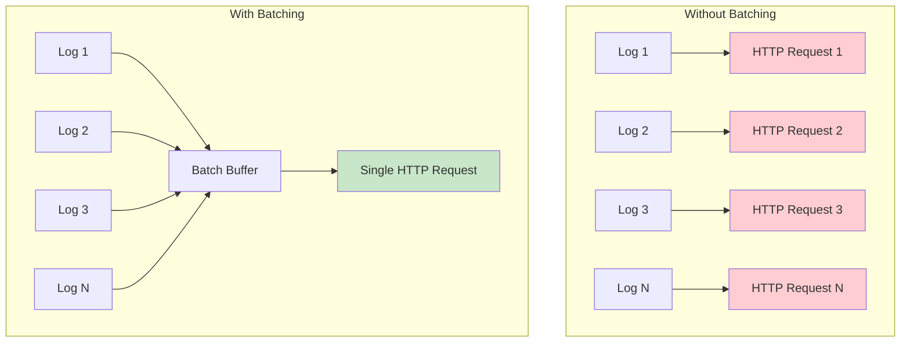

### Resource Efficiency

| Aspect | Without Batching | With Batching | Improvement |
|--------|------------------|---------------|-------------|
| HTTP Requests | N requests | 1 request | N:1 ratio |
| Network Overhead | High | Low | Significant reduction |
| Connection Pooling | Inefficient | Efficient | Better utilization |
| Throughput | Limited | High | Substantial increase |

## Batch Configuration

### Default Behavior

The exporter automatically batches all log records from a single `ConsumeLogs` call:

```yaml
exporters:
  securityevent:
    endpoint: https://api.example.com/security-events
    # Batching is automatic - no configuration needed
```

### Batch Size Limits

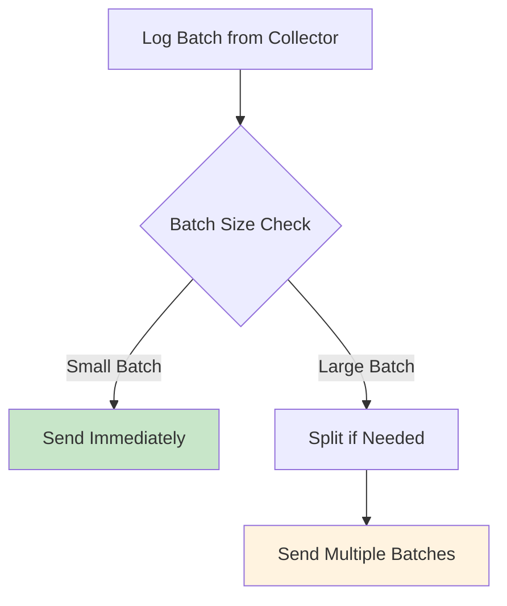

### Memory Management

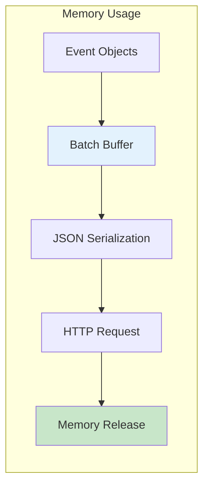

## JSON Payload Format

### Single Event Format

```json
{
  "timestamp": "2024-01-15T10:30:00Z",
  "severity": "ERROR",
  "message": "Security event detected",
  "resource.service.name": "my-service",
  "attributes.user.id": "user123"
}
```

### Batched Events Format

```json
[
  {
    "timestamp": "2024-01-15T10:30:00Z",
    "severity": "ERROR",
    "message": "Security event detected",
    "resource.service.name": "my-service",
    "attributes.user.id": "user123"
  },
  {
    "timestamp": "2024-01-15T10:30:01Z",
    "severity": "WARN",
    "message": "Suspicious activity",
    "resource.service.name": "my-service",
    "attributes.ip.address": "192.168.1.100"
  }
]
```

## Error Handling in Batches

### Batch-Level Error Handling

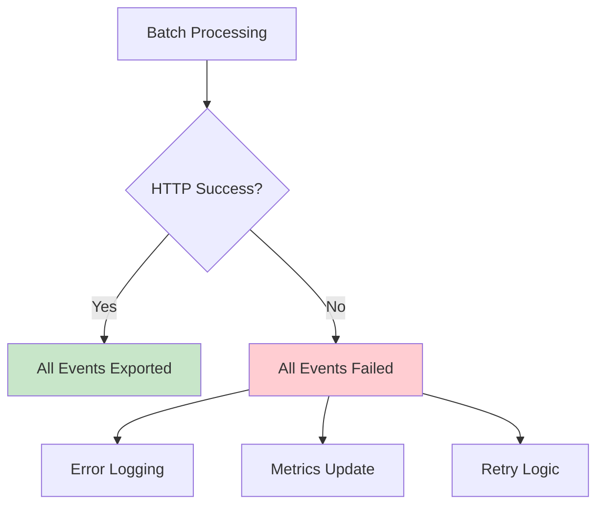

### Individual Event Errors

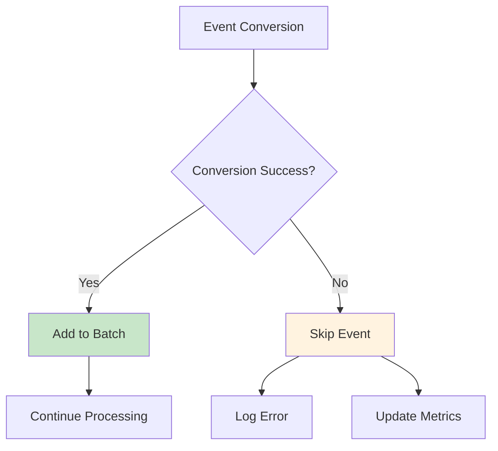

## Performance Metrics

### Batch Metrics

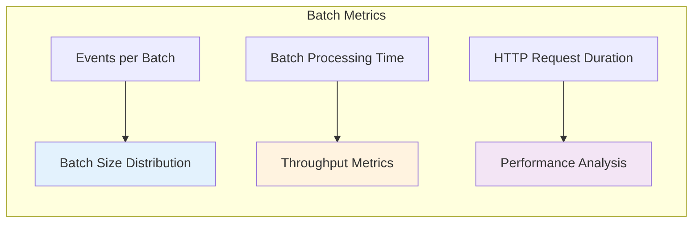

### Monitoring Batch Performance

```bash
# View batch metrics in logs
docker logs otel-security-exporter | grep "batch"

# Example output:
# INFO Completed processing logs batch {"total_log_records": 50, "successful_events": 48, "failed_events": 2, "http_requests": 1}
```

## Best Practices

### 1. Optimal Batch Sizes

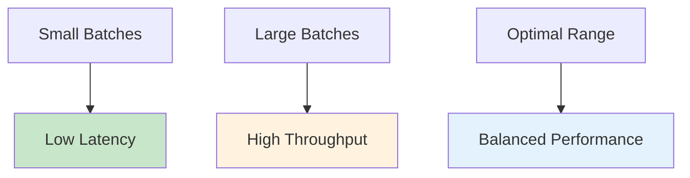

### 2. Network Considerations

- **Bandwidth**: Larger batches reduce network overhead
- **Latency**: Smaller batches provide lower latency
- **Reliability**: Batches provide atomic delivery

### 3. Memory Management


## Troubleshooting

### Common Issues

1. **Large Memory Usage**: Monitor batch sizes and adjust collector configuration
2. **High Latency**: Check network connectivity and endpoint performance
3. **Batch Failures**: Verify endpoint configuration and authentication

### Debug Mode

Enable debug logging to monitor batch behavior:

```yaml
service:
  telemetry:
    logs:
      level: debug
```

### Performance Tuning

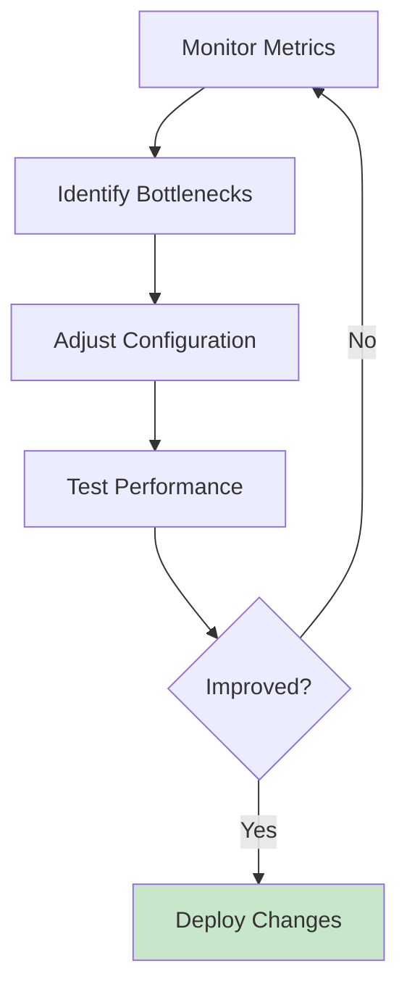

## Configuration Examples

### High Throughput Configuration

```yaml
exporters:
  securityevent:
    endpoint: https://api.example.com/security-events
    timeout: 30s
    headers:
      authorization: "Bearer token"
    default_attributes:
      source: "high-throughput-collector"

processors:
  batch:
    timeout: 5s
    send_batch_size: 1000
    send_batch_max_size: 2000

service:
  pipelines:
    logs:
      receivers: [otlp]
      processors: [batch]
      exporters: [securityevent]
```

### Low Latency Configuration

```yaml
exporters:
  securityevent:
    endpoint: https://api.example.com/security-events
    timeout: 5s
    headers:
      authorization: "Bearer token"

processors:
  batch:
    timeout: 1s
    send_batch_size: 10
    send_batch_max_size: 50

service:
  pipelines:
    logs:
      receivers: [otlp]
      processors: [batch]
      exporters: [securityevent]
```
