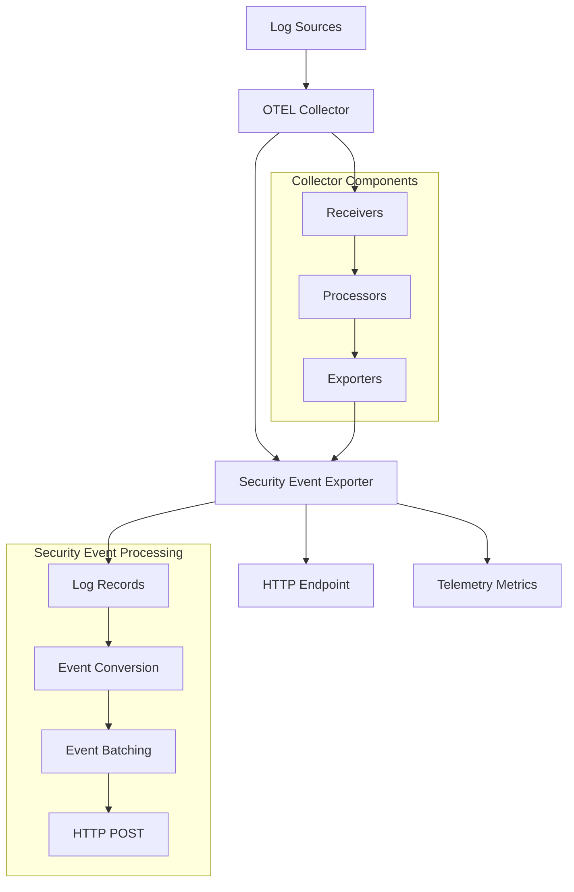
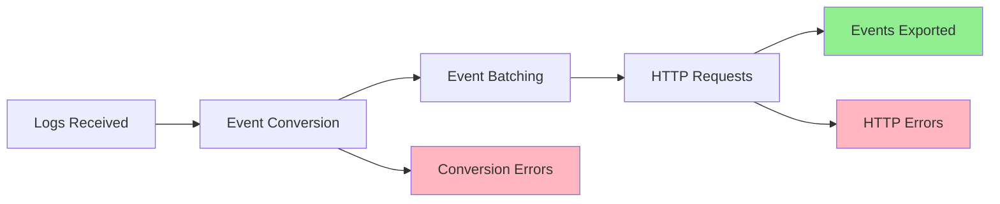

# OpenTelemetry Security Event Exporter

<div align="center">

    

**A custom OpenTelemetry Collector exporter that transforms logs into security events**

[📚 Documentation](https://henrikrexed.github.io/SecurityEventExporter/) • [API Reference](API.md) • [Deployment Guide](deployment/docker-deployment.md) • [Examples](getting-started/quick-start.md)

</div>

---

## 🔍 Overview

The Security Event Exporter converts OpenTelemetry log records into security events in JSON format and sends them to a configurable HTTP endpoint. It's particularly useful for:

- Security monitoring and alerting
- SIEM integration
- Compliance reporting
- Security event correlation

## 🚀 Quick Start

```bash
# Run with Docker
docker run -d \
  --name otel-security-exporter \
  -p 4317:4317 \
  -p 8888:8888 \
  hrexed/otel-collector-sec-event:latest

# Send logs to the collector
curl -X POST http://localhost:4317/v1/logs \
  -H "Content-Type: application/json" \
  -d '{"resourceLogs":[{"resource":{"attributes":[{"key":"service.name","value":{"stringValue":"my-service"}}]},"scopeLogs":[{"logRecords":[{"body":{"stringValue":"Security event detected"},"severityText":"ERROR"}]}]}]}'
```

## ✨ Key Features

- **Log to Security Event Transformation**: Converts OpenTelemetry logs to structured security events
- **HTTP Endpoint Support**: Configurable HTTP endpoint for security event delivery
- **Custom Headers**: Support for API tokens and custom headers
- **Default Attributes**: Configurable default attributes for all security events
- **Retry Logic**: Built-in retry mechanism for failed requests
- **Queue Management**: Configurable queue settings for high-throughput scenarios
- **Event Batching**: Efficiently batches multiple security events into single HTTP POST requests
- **Telemetry Metrics**: Comprehensive metrics for monitoring logs received, events exported, and HTTP performance
- **Docker Support**: Pre-built Docker image with OpenTelemetry Collector

## 📊 Architecture



## 📈 Telemetry Metrics

The exporter provides comprehensive metrics for monitoring:



## 🐳 Docker Support

Ready-to-use Docker image with all dependencies:

```bash
# Pull the latest image
docker pull hrexed/otel-collector-sec-event:latest

# Run with custom configuration
docker run -d \
  --name otel-security-exporter \
  -v $(pwd)/config.yaml:/otel/config.yaml \
  hrexed/otel-collector-sec-event:latest \
  --config /otel/config.yaml
```

## 📚 Documentation

Explore our comprehensive documentation:

- **[Getting Started](getting-started/quick-start.md)** - Quick setup and basic configuration
- **[Configuration](getting-started/configuration.md)** - Detailed configuration options
- **[Telemetry Metrics](monitoring/telemetry-metrics.md)** - Monitoring and metrics guide
- **[Deployment](deployment/docker-deployment.md)** - Production deployment guide
- **[API Reference](API.md)** - Complete API documentation

## 🤝 Contributing

We welcome contributions! Please see our [GitHub repository](https://github.com/opentelemetry/securityeventexporter) for details.

## 📄 License

This project is licensed under the Apache License 2.0 - see the [LICENSE](https://github.com/opentelemetry/securityeventexporter/blob/main/LICENSE) file for details.

## 🆘 Support

- **Documentation**: Browse this documentation site
- **Issues**: Report bugs and request features on [GitHub](https://github.com/opentelemetry/securityeventexporter/issues)
- **Discussions**: Join the conversation in [GitHub Discussions](https://github.com/opentelemetry/securityeventexporter/discussions)

---

<div align="center">
  <strong>Built with ❤️ for the OpenTelemetry community</strong>
</div>
