# Telemetry Metrics

The Security Event Exporter provides comprehensive telemetry metrics to monitor its performance and operational status. These metrics help you understand the exporter's behavior, identify potential issues, and optimize performance.

## Metrics Overview

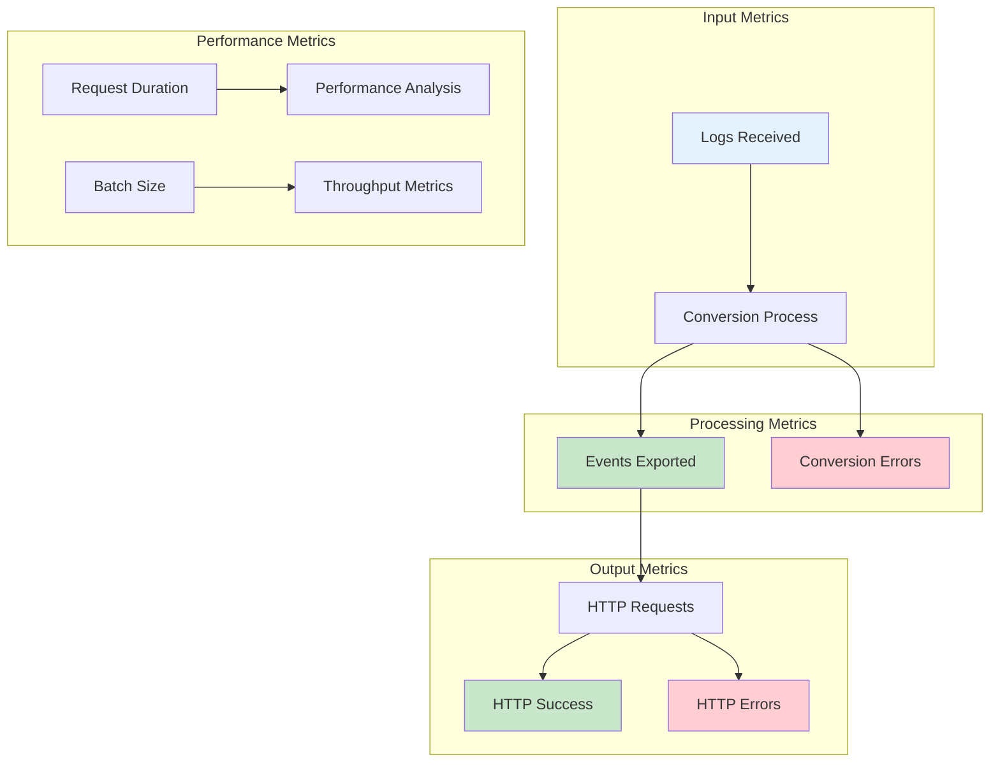

## Core Metrics

### Input Metrics

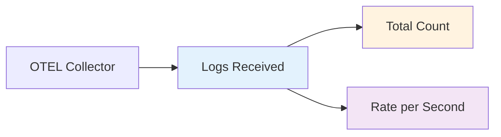

| Metric | Description | Type | Example |
|--------|-------------|------|---------|
| `logs_received` | Total number of log records received from the OpenTelemetry Collector | Counter | 1,000 logs |
| `logs_received_rate` | Rate of logs received per second | Gauge | 50 logs/sec |

### Processing Metrics

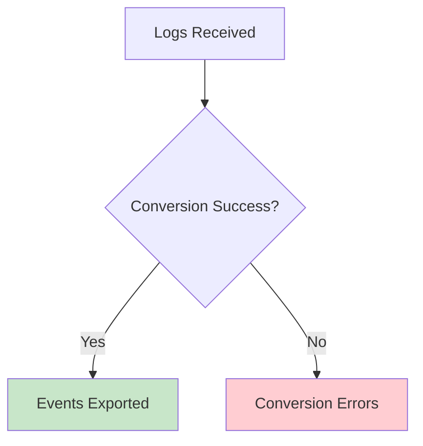

| Metric | Description | Type | Example |
|--------|-------------|------|---------|
| `events_exported` | Total number of security events successfully exported | Counter | 950 events |
| `conversion_errors` | Total number of log records that failed to convert to security events | Counter | 50 errors |
| `conversion_success_rate` | Percentage of successful conversions | Gauge | 95% |

### Output Metrics

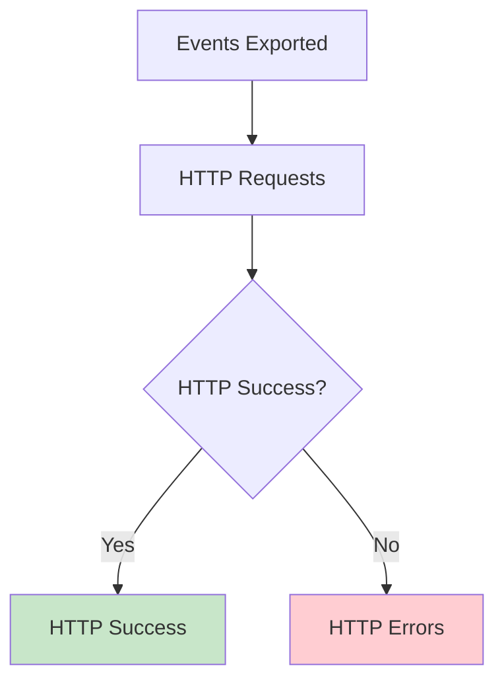

| Metric | Description | Type | Example |
|--------|-------------|------|---------|
| `http_requests` | Total number of HTTP requests sent to the security event endpoint | Counter | 20 requests |
| `http_errors` | Total number of HTTP requests that failed | Counter | 2 errors |
| `http_success_rate` | Percentage of successful HTTP requests | Gauge | 90% |

### Performance Metrics

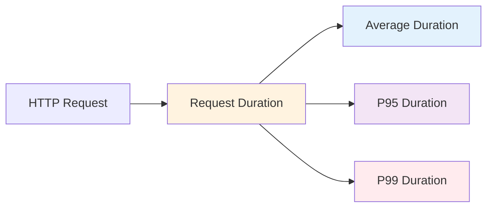

| Metric | Description | Type | Example |
|--------|-------------|------|---------|
| `http_request_duration` | Duration of HTTP requests | Histogram | 150ms average |
| `batch_size` | Number of events per batch | Histogram | 25 events/batch |
| `throughput` | Events processed per second | Gauge | 100 events/sec |

## Metrics Collection Flow

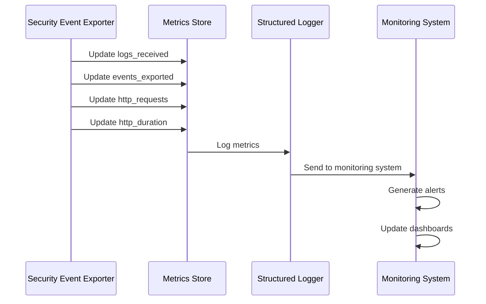

## Metrics Reporting

### Startup Metrics

```json
{
  "level": "debug",
  "msg": "Initialized telemetry metrics",
  "logs_received": 0,
  "events_exported": 0,
  "events_failed": 0,
  "conversion_errors": 0,
  "http_requests": 0,
  "http_errors": 0
}
```

### Batch Processing Metrics

```json
{
  "level": "info",
  "msg": "Completed processing logs batch",
  "total_resource_logs": 5,
  "total_log_records": 50,
  "successful_events": 48,
  "failed_events": 2,
  "http_requests": 1
}
```

### Shutdown Metrics

```json
{
  "level": "info",
  "msg": "Final telemetry metrics",
  "logs_received": 1000,
  "events_exported": 950,
  "events_failed": 50,
  "conversion_errors": 25,
  "http_requests": 20,
  "http_errors": 5,
  "http_duration_samples": 20
}
```

### Performance Metrics

```json
{
  "level": "info",
  "msg": "HTTP request performance metrics",
  "average_duration": "150ms",
  "sample_count": 20
}
```

## Monitoring and Alerting

### Key Performance Indicators

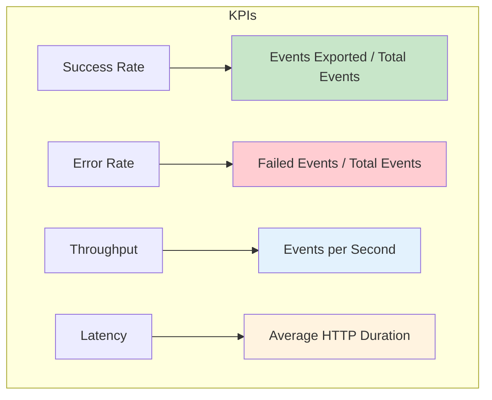

### Alerting Rules

```yaml
# Example alerting rules
alerts:
  - name: HighFailureRate
    condition: events_failed / (events_exported + events_failed) > 0.1
    message: "Security event exporter failure rate is above 10%"
    severity: warning
  
  - name: HighHTTPErrorRate
    condition: http_errors / http_requests > 0.05
    message: "HTTP error rate is above 5%"
    severity: critical
  
  - name: SlowResponseTime
    condition: average_duration > "5s"
    message: "Average HTTP response time is above 5 seconds"
    severity: warning
  
  - name: LowThroughput
    condition: throughput < 10
    message: "Event throughput is below 10 events per second"
    severity: warning
```

### Dashboard Metrics

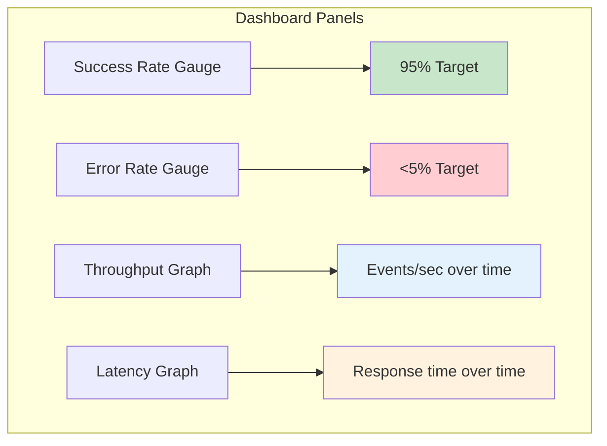

## Performance Optimization

### Metrics-Driven Optimization

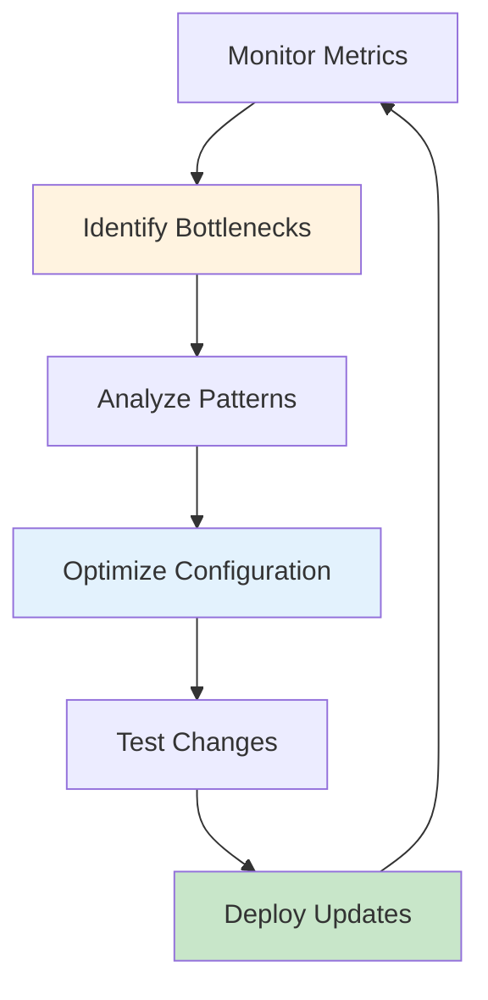

### Optimization Strategies

1. **Batch Size Optimization**
   - Monitor `batch_size` metrics
   - Adjust collector batch processor settings
   - Balance throughput vs. latency

2. **HTTP Performance Optimization**
   - Monitor `http_request_duration`
   - Optimize endpoint configuration
   - Adjust timeout settings

3. **Error Rate Optimization**
   - Monitor `conversion_errors` and `http_errors`
   - Identify problematic log patterns
   - Adjust error handling logic

## Integration with Monitoring Systems

### Prometheus Integration

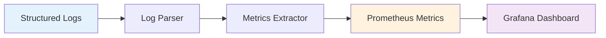

### Log Parsing for Metrics

```bash
# Extract metrics from logs
grep "Final telemetry metrics" collector.logs | \
jq -r '.logs_received, .events_exported, .events_failed' | \
awk '{print "security_event_exporter_logs_received_total " $1; print "security_event_exporter_events_exported_total " $2; print "security_event_exporter_events_failed_total " $3}'
```

### Grafana Dashboard

```json
{
  "dashboard": {
    "title": "Security Event Exporter Metrics",
    "panels": [
      {
        "title": "Success Rate",
        "type": "stat",
        "targets": [
          {
            "expr": "security_event_exporter_events_exported_total / (security_event_exporter_events_exported_total + security_event_exporter_events_failed_total) * 100"
          }
        ]
      },
      {
        "title": "Throughput",
        "type": "graph",
        "targets": [
          {
            "expr": "rate(security_event_exporter_events_exported_total[5m])"
          }
        ]
      }
    ]
  }
}
```

## Troubleshooting

### Common Issues and Metrics

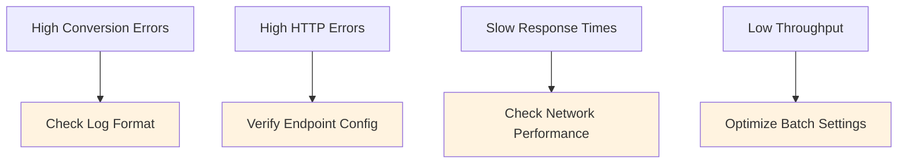

### Debug Mode

Enable debug logging to get detailed metrics information:

```yaml
service:
  telemetry:
    logs:
      level: debug
```

This provides detailed metrics at each processing step, helping identify bottlenecks and issues.

### Performance Analysis


## Future Enhancements

Planned enhancements for metrics collection:

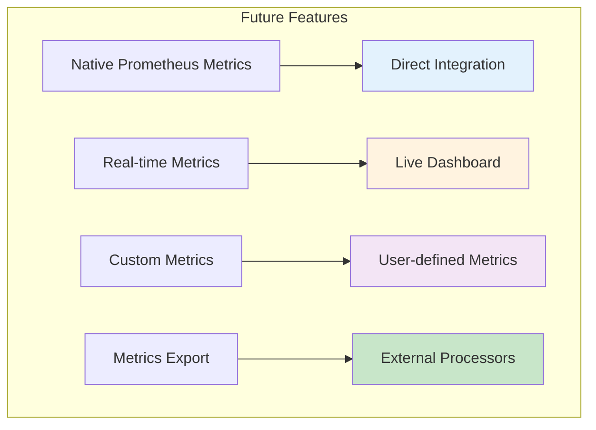

1. **Native Prometheus Metrics**: Direct integration with Prometheus metrics
2. **Real-time Metrics**: Live metrics dashboard
3. **Custom Metrics**: User-defined metrics for specific use cases
4. **Metrics Export**: Export metrics to external processors
